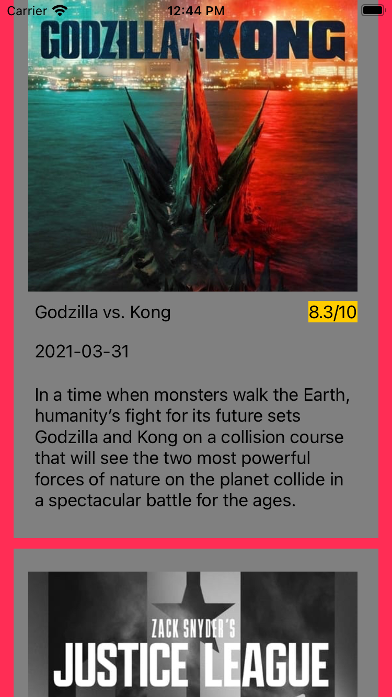

# IMDBViewer
Creating a simple app to parse and show films from IMDB

Uses these Pods

youtube-ios-player-helper, Alamofire, Kingfisher

Current screenshots

 

ToDo :
* Create a search screen
* Add actors to the movie details page
* Add functionality to switch between popular, top rated and upcoming movies
* Reskin
